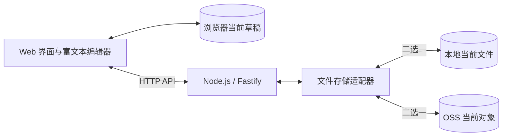

# 一期 MVP 技术架构与选型

状态：设计提案，尚未实现或实测。更新日期：2026-09-23。

## 1. 已确认的范围

Personal Memory 长期发展为个人知识库，一期先完成体验好的个人在线记事本：

- 开源、支持自托管；一个部署一个个人账号，支持本人多设备使用。
- 开发 Node.js 服务端和 Web 端，打开快和多端体验是硬指标。
- 编辑体验参考 Notion，优先富文本；功能复杂度必须服从打开速度。
- 服务端采用文件存储，本地目录或 OSS 二选一；正文不使用 JSON 封装。
- 数据文件只保存笔记内容及必要格式；样式、主题和编辑器 UI 状态由 Web 端管理。
- 每篇笔记只保留当前文件，一期不做搜索、索引、备份和历史版本。

推荐将 MVP 收敛为：登录、笔记列表、新建、打开、富文本编辑、自动保存、删除，以及多设备访问。后续历史版本仅预留独立扩展位置，当前不生成历史文件。

## 2. 推荐技术栈

| 部分 | 选择 | 用途 |
| --- | --- | --- |
| 语言与仓库 | TypeScript、pnpm workspace | 统一前后端类型和构建 |
| Web | React、Vite、React Router | 静态应用、路由和按需加载 |
| 编辑器 | Tiptap / ProseMirror，搭配 Markdown 转换 | 基础富文本、快捷键、撤销重做；先验证内容往返 |
| 样式 | CSS Modules、系统字体、按需图标 | 控制启动依赖和样式体积 |
| 浏览器草稿 | IndexedDB、Dexie | 保存当前草稿，支持再次打开恢复 |
| 服务端 | Node.js 24 LTS、Fastify 5 | 同源提供静态资源与 HTTP API |
| 正文格式 | 推荐 UTF-8 Markdown 文件 | 每篇笔记一个当前内容文件，以 Markdown 表达基础格式 |
| 服务端存储 | 本地文件 / 阿里云 OSS 适配器 | 部署时二选一，不需要数据库 |
| 多端刷新 | HTTP 条件请求、前台轮询 | 打开或回到前台时检查最新内容 |
| 验证 | Vitest、Fastify inject、Playwright、手机实机 | 保存正确性、浏览器与输入体验 |
| 部署 | 单应用容器、配置目录、所选存储 | 保持个人自托管简单 |

Node.js 24 当前处于 LTS；具体依赖版本在原型阶段核对稳定版本和相互兼容性，再由 lockfile 固定。[Node.js 发布状态](https://nodejs.org/en/about/previous-releases)。

React + Vite 适合本项目静态应用与浏览器编辑的组织方式。Tiptap 提供 Markdown 双向转换扩展，但官方当前仍标记为 Beta，因此编辑器选型需先通过支持范围内的内容往返与性能验证，不能假设转换完全无损。[React 文档](https://react.dev/learn/build-a-react-app-from-scratch)、[Tiptap Markdown 文档](https://tiptap.dev/docs/editor/markdown)。

## 3. MVP 编辑功能

推荐先做段落、标题、粗体、斜体、链接、列表、任务列表、引用和基础代码块，配合简洁工具栏、常用快捷键及简单斜杠菜单。手机适配触摸、选区和虚拟键盘。

编辑器提供可视化编辑，用户不必手写 Markdown。MVP 仅开放能用约定 Markdown 语法表达的内容格式；字体、配色和页面布局属于应用呈现，不进入笔记文件。

基础块使用普通 DOM，编辑器自身管理实时内容，避免每个按键引发整页重渲染。依赖较多的编辑功能在后续需求明确后再评估。[Tiptap 性能指南](https://tiptap.dev/docs/guides/performance)。

## 4. 总体结构

所有设备通过同一个 Node.js 服务读写；一期只运行一个活动服务实例。OSS 凭据保留在服务端。文件格式、列表方式和写入约束见 [存储设计](storage.md)。

## 5. 打开与保存

打开时先加载核心编辑依赖并恢复当前本地草稿，列表在旁路加载。已使用设备的草稿恢复不等待列表请求；首次登录和未缓存笔记仍需联网。指定笔记尚未取得内容时明确显示加载状态，不能把空白编辑区当作已打开原笔记。

静态资源使用内容哈希和浏览器 HTTP 缓存。MVP 不依赖 Service Worker 或 PWA 更新机制；已打开页面断网时保留本地草稿，不承诺断网后从零启动网站。

正文推荐直接以 Markdown 文本传输和保存。编辑器保存时导出内容与必要格式，打开时转换成内部文档；Web 统一负责样式。文件不包含页面 HTML、CSS、DOM、编辑器 UI 状态或隐藏的提交标记。Markdown 仍有解析成本，性能需要测量完整打开链路。

每次内容变化进入有序的浏览器草稿保存队列；允许合并尚未开始的保存任务，但不能只等远端请求才保存草稿。远端自动保存建议停止输入 500 ms 后触发，持续输入最多 2 s 提交一次，每篇笔记仅有一个请求在途。这些时间属于待验证的设计参数。

保存确认只对应已发送的那次内容，发送期间的新输入继续保留。中文组合输入过程中不替换文档或重建编辑器。

| 界面状态 | 含义 |
| --- | --- |
| 正在保存 | 当前输入尚未完成浏览器持久化 |
| 已保存到本机，待同步 | 当前草稿已落到 IndexedDB，服务端尚未确认 |
| 已同步 | 所选服务端存储已确认当前提交，浏览器已记录结果 |
| 保存失败 / 待确认 | 保留草稿，提示重试或复制内容，不假报成功 |

浏览器数据可能被清除或回收；本地写入失败要显式反馈。浏览器草稿不是另一个服务端主存储。[浏览器存储说明](https://developer.mozilla.org/en-US/docs/Web/API/Storage_API/Storage_quotas_and_eviction_criteria)。

## 6. 多设备使用

打开笔记和回到前台时检查最新内容；页面可见时建议每 5 s 条件检查当前笔记，列表按需或低频刷新。暂不引入 SSE、WebSocket、全局变更日志和增量同步游标。

保留一个当前文件校验标识用于并发检查。手机与电脑基于同一旧内容保存时，后一份提交被识别为冲突：保留本地草稿，提示用户查看最新内容或复制到新笔记，不自动覆盖正在编辑的内容，也不自动生成历史副本。

删除针对当前文件；其他设备再提交旧编辑时不能把更新当成新建。多标签页使用独立草稿槽位，避免本地草稿互相覆盖。这里的当前文件校验不是历史版本功能。

## 7. API 草案

| 接口 | 职责 |
| --- | --- |
| `POST /api/v1/auth/login`、`POST /api/v1/auth/logout`、`GET /api/v1/auth/session` | 单账号登录和会话 |
| `GET /api/v1/notes?cursor=...` | 直接列举当前文件，分页返回列表信息 |
| `GET /api/v1/notes/:id` | 返回 Markdown 正文及当前内容摘要 |
| `POST /api/v1/notes/:id` | 用稳定的客户端 ID 创建笔记；不能覆盖已存在文件 |
| `PUT /api/v1/notes/:id` | 校验读取时的标识，替换当前文件 |
| `DELETE /api/v1/notes/:id` | 校验当前标识后删除 |
| `GET /healthz` | 应用健康检查 |

正文请求和响应直接携带 UTF-8 Markdown 文本，不包进 JSON 字符串。标题从内容首个非空行派生，校验标识从文件字节计算，经响应头返回；都不向笔记文件插入应用元数据。列表、登录和错误等少量控制信息可使用常规 JSON，它们不是正文存储格式。

## 8. 认证与部署

部署侧配置唯一账号的密码哈希及会话密钥，不开放注册。推荐使用异步 scrypt 校验密码、登录限流和 `@fastify/secure-session` 的加密 Cookie 会话；设置会话有效期、HttpOnly、Secure、SameSite，写接口校验 Origin 和 CSRF。改密码时使旧会话失效，不为 MVP 建立会话数据库。[Fastify 会话插件](https://github.com/fastify/fastify-secure-session)。

Web 与 API 同源，正文读取必须认证。Markdown 渲染使用受控的内容节点和链接协议，不执行其中的原始 HTML；代码块里的代码作为文本展示。退出时处理未同步草稿并清理账号缓存。

提供一个 Linux 应用镜像。配置选择 `local` 或 `oss`，配置文件和必要的写入状态放在受限部署目录。应用本身不提供备份、搜索、索引或历史版本服务。

## 9. 实现与验证顺序

1. 最小富文本与 Markdown 文件原型：测打开、输入、本地草稿和格式往返。
2. 本地存储闭环：登录、列表、新建、编辑、自动保存、删除。
3. OSS 适配：在真实测试 Bucket 验证相同读写行为及超时处理。
4. 多端验收：手机输入、前后台切换、并发保存、本地草稿恢复及正式构建性能。

具体指标见 [MVP 性能验收](performance.md)。当前只有设计文档，尚未实现上述功能或取得测试成绩。
